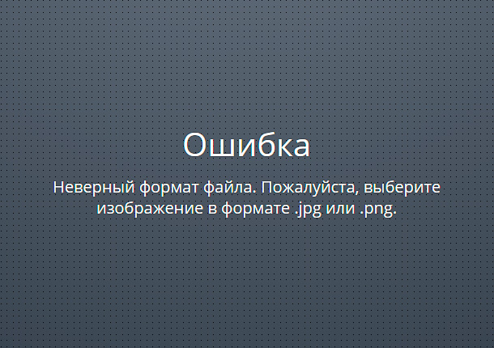
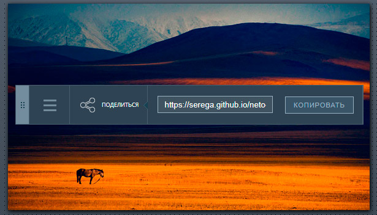
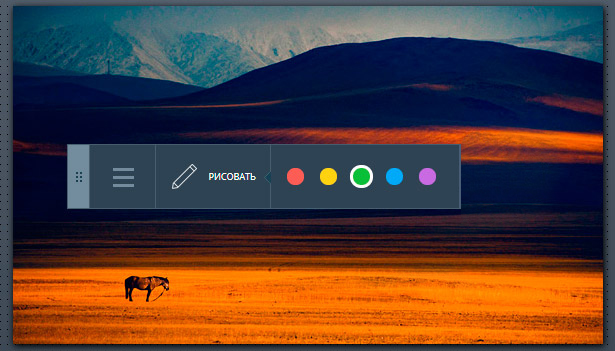
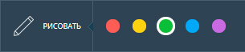
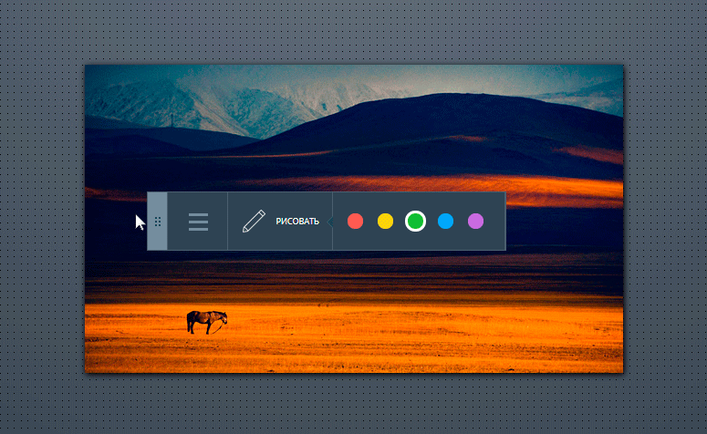

Клиентскую часть сервиса - рецензирования изображений.
===

Сервис предоставляет пользователям следующие возможности:
- загружать изображения;
- добавлять комментарии к конкретной части изображения;
- рисовать поверх изображения.

А также сервис наделен элементами совместной работы:
- загруженное изображение имеет уникальную ссылку, которой можно поделиться;
- все пользователи, просматривающие изображение, уведомляются о новых комментариях к нему;
- все пользователи, просматривающие изображение в режиме рисования, видят, что рисуют другие пользователи.

## Интерфейс

Приложение имет два состояния:

1. Публикация (_состояние по умолчанию_):

2. Рецензирование:

Приложение имеет четыре компонента:
- _Холст_, основная рабочая область, в которой располагаются рецензируемое изображение и плавающее меню;
- _Плавающее меню_, позволяющее переключаться между режимами и инструментами;
- _Маска со штрихами пользователей_, созданными в режиме **Рисование**;
- _Комментарии пользователей_, оставленные в режиме **Комментирование**.

Компоненты обозначены на рисунке ниже:

### Публикация

Этот режим открывается по умолчанию при открытии интерфейса: 

В нём доступна всего одна функция: выбор изображения и его публикация на сервере. Изображение можно выбрать двумя способами:

1. Кликнуть на поле «Загрузить новое», после чего откроется стандартный диалог выбора файла. Выбор ограничен только JPG и PNG изображениями.
2. Перетащить файл изображения и бросить на холст. 

В обоих случаях, сразу после успешного выбора изображения, оно публикуется на сервере. 

Пока изображение загружается на сервер, должен отображаться прелоадер:

В случае успеха интерфейс переходит в состояние **Рецензирование**, режим «Поделиться».

Успешно загруженное изображение должно оставаться на холсте при обновлении страницы браузера. При этом, если открыть приложение заново (не по ссылке из «Поделиться») в том же окне, должен отображаться чистый холст.

#### Ошибки при публикации

Если на холст брошена не картинка, либо картинка в другом формате (не JPG и PNG), должно появиться сообщение об ошибке:

Если при публикации возникает какая-либо другая ошибка, также необходимо сообщить о ней пользователю. При этом, у пользователя остаётся возможность попробовать загрузить выбранное изображение повторно, либо выбрать другое изображение.

После успешной загрузки и отображения изображения на холсте, последующие изображения, брошенные на холст или на имеющееся изображение, должны быть проигнорированы, а пользователю должно быть показано сообщение с рекомендацией воспользоваться опцией «Загрузить новое» в меню:

### Рецензирование

В состояние **Рецензирование** интерфейс переходит после успешной загрузки изображения:

В это состояние возможно попасть двумя способами:
1. После успешной публикации изображения открывается режим «Поделиться» (_описано в состоянии «Публикация»_).
2. При переходе по ссылке скопированной из режима «Поделиться» открывается режимы «Комментирование» (_будет описан ниже_).

В данном состоянии **Рецензирования** доступно три режима: комментирование, рисование, поделиться. Всегда активен один из этих трёх режимов. Вариант, когда все режимы не активны считается ошибкой.

#### Режим «Комментирование»

Режим открывается при переходе по ссылке полученной в режиме «Поделиться». А так же при клике на пункт «Комментарии» в меню. В этом режиме можно добавлять новые комментарии.

Доступен переключатель, позволяющий показать или скрывать маркеры комментариев.

По умолчанию, маркеры отображаются. И при появлении нового комментария, добавленного другим пользователем, его маркер должен тоже необходимо отобразить. Маркеры отображаются во всех режимах. При клике на каждый маркер открывается окно с комментарием / цепочкой комментариев и формой для отправки нового комментария:

Если в меню выбрать «Скрыть комментарии», то маркеров комментариев не видно:

Это может потребоваться, например, чтобы маркеры не мешали рисовать (_режим «Рисование»_). Маркеры комментариев можно вернуть только выбрав в меню «Показать комментарии». Если комментарии скрыты, то при появлении комментария, который добавил другой пользователь, его маркер не должен появляться. 

При клике в любую точку на холсте, открывается форма добавления нового комментария. Она не должна скрываться при клике на маркер. При добавления нового комментария необходимо показать прелоадер на время, пока данные не будут отправлены:

Одновременно может быть показана только один блок комментариев, либо форма добавления нового комментария. Открытый ранее блок комментария или форма должны скрываться. Форма добавления комментария не должна оставлять маркер при скрытии.

#### Режим «Рисование»

Здесь доступна возможность выбора цвета пера из пяти доступных: 
- красный, 
- жёлтый, 
- зелёный, 
- синий, 
- и фиолетовый (`#b36ade`).

#### Режим «Поделиться»

Открывается сразу после публикации. Тут доступна ссылка, перейдя по которой приложение откроется и сразу перейдет в состояние «Рецензироние» именно с этим изображением.

#### Переключение между режимами

Для переключения между режимами пользователю доступно плавающее меню. Меню можно переместить в любую часть холста, если зажать кнопку мыши на «корешке». Перемещённое меню должно сохранять своё положение при обновлении страницы.

При перемещении меню не должно выходить за границы экрана:

Раскрыть меню и выбрать другие режимы можно, кликнув на поле «бургер-меню». Переключение осуществляется следующим образом:

При переключении режимов также есть возможность вернуться в состояние **Публикация**.

Меню всегда должно отражать текущее состояние и режим приложения. Если мы в состоянии **Публикация**, то поле «бургер-меню» не отображается, так как доступен только один пункт. Если мы в состоянии **Рецензирование**, то выбран один из режимов, остальные скрыты в поле «бургер-меню».

